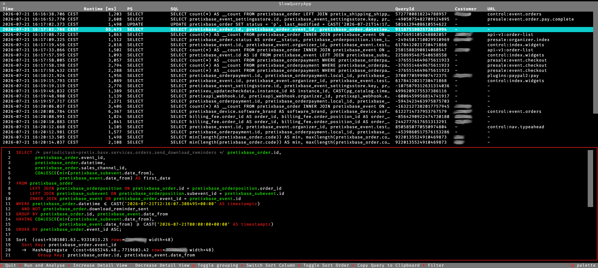

slowtop - Browse and Analyse Slow PostgreSQL Queries
======================================================



Features
---------
* Find slow queries in log files or pg_stat_statements
* Show overview over all queries with their duration
* Show queries scrollable, pretty printed with syntax highlighting
* Show queries grouped by query_id with statistical data
* Send selected queries plan to [explain.dalibo.com](https://explain.dalibo.com) or an compatible site
* Run queries to get detailed execution plan
* Copy queries to clipboard (even works over ssh)
* Extendable with your custom fields
* Works well with [pretix/django-querytagger](https://github.com/pretix/django-querytagger)
* All the features Textual brings out of the box: keybindings, screenshots, etc.

Dependencies
--------------
* PostgreSQL with logs in JSON-Format and/or pg_stat_statements enabled (tested with PostgreSQL 15)
* textual
* psycopg
* pglast
* requests

Installation
--------------
* Clone this repo
* Create config based on config.py.example
* Create venv: `python -m pip venv && source venv/bin/activate && pip install -r requirements.txt`

Usage
------
```
$ python ./main.py [-gs] [logfiles…]
```

By default the tool reads the latest postgres log file from /var/log/postgres/,
you can supply other log files as argument. Alternatively you can use the
option `-s` to read pg_stat_statements instead. The option `-g` opens the
grouped view on startup, but you can also switch between grouped and
ungrouped view during runtime.

Security
--------

If you discover a security issue, please contact us at security@pretix.eu and see our [Responsible Disclosure Policy](https://docs.pretix.eu/trust/security/disclosure/) further information.

License
--------
The code in this repository is published under the terms of the GPLv3. See the
LICENSE file for the complete license text.
